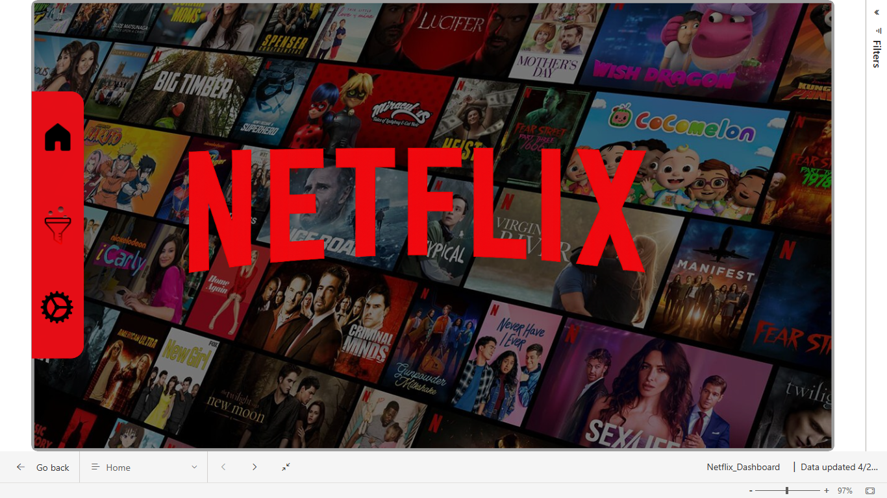
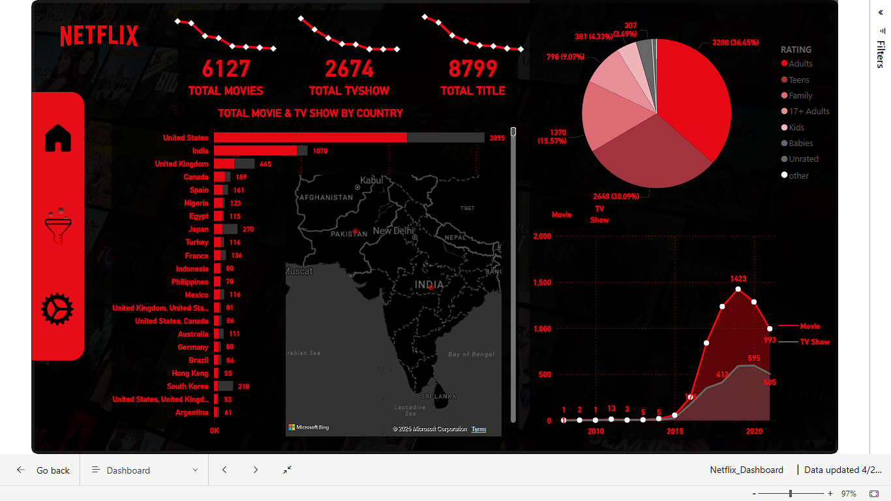
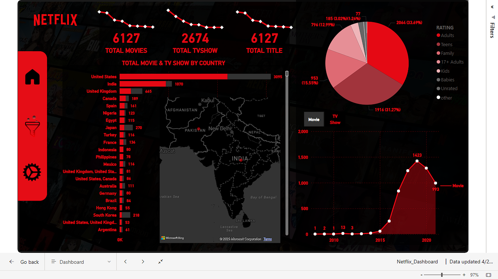
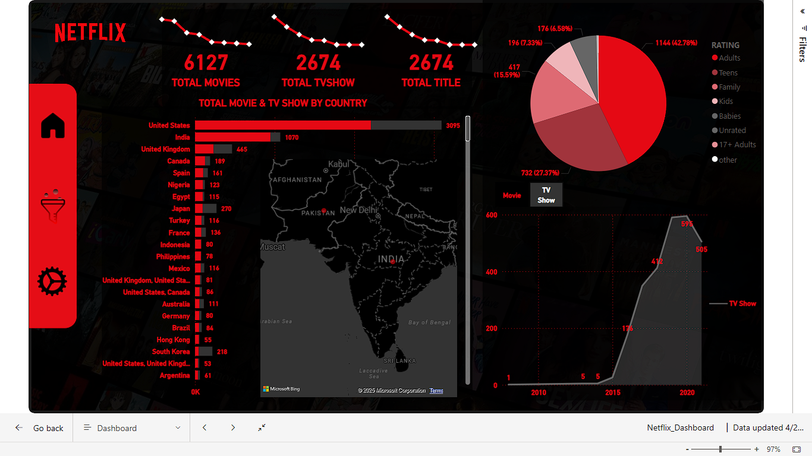
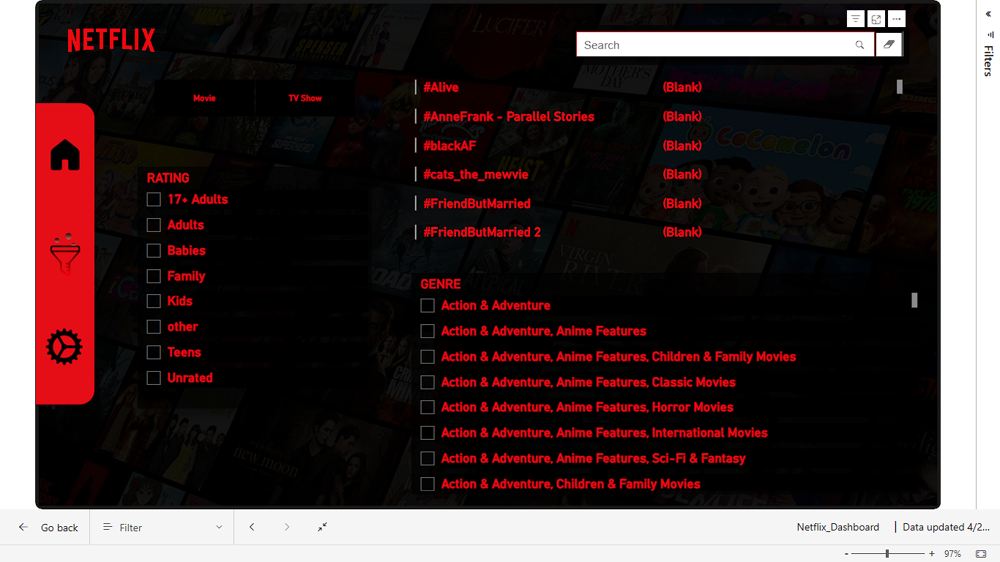

# 🎬 Netflix Dashboard - Power BI

This is an interactive Power BI dashboard built using Netflix's content data. It provides insights into the type, release trends, and production countries of movies and TV shows available on Netflix.

---

##  Dashboard Highlights

-  Year-wise content addition trends
-  Country-wise content production
-  Genre distribution of movies & TV shows
-  Filter by type, release year, and more

---
## Dashboard Screenshot

---

##  Tools Used

- Power BI
- Microsoft Excel / CSV for data cleaning
- Netflix Titles Dataset from [Kaggle](https://www.kaggle.com/datasets/shivamb/netflix-shows)

---
@Rajkamlj9
